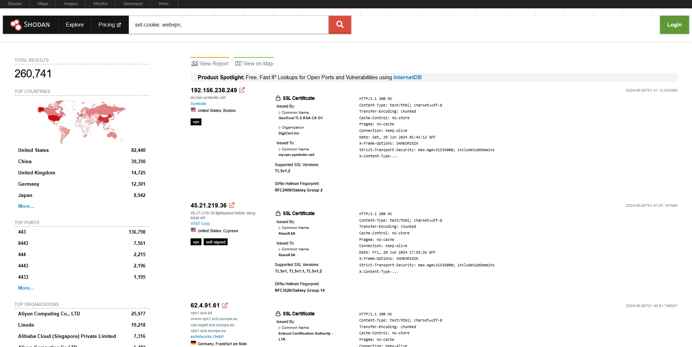
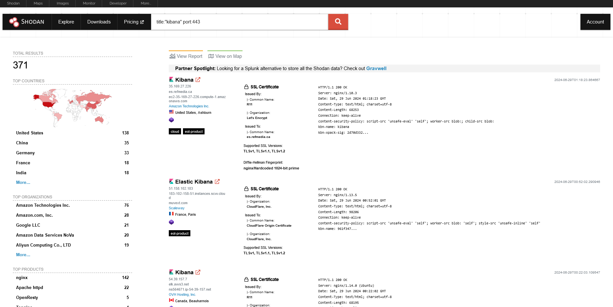

## Breaking the Internet with Shodan

For those who are unfamiliar with Shodan, it is a search engine that allows users to locate particular computer types connected to the internet by utilizing various filters. This information is sourced from Google. However, in my opinion, it has a far greater role in your bounty when it comes to recon. On their official website, you can read more about it [here](https://www.shodan.io/).

The question is, why and how do we use it? Well, tbh, I use it for CVEs and open ports but you can use it for a ton of things i.e server enumeration, filtering the targets, etc. Not putting many words on WHY, since it is a personal choice. You can just Google it and find some very cool stuff out there. So I will be talking about HOW and that is my way of work in everything. Once you work on how things work, you automatically know the answer to WHY 🙂

Let's say for the moment that you need to locate a well-known CVE on your target, which is undoubtedly a large organization (you can't discover much information on a tiny target, unfortunately:|). We need to locate some Shodan dorks, then. This dork, `set-cookie: webvpn;`, proved to be quite helpful to me. I reported a lot of P1s on Hackerone. But in many situations, it turned out to be a ruse because someone else was already hunting that target. Nevertheless, finding something with it is more important than whether it is valid or a duplicate. You've won, GZ, if you do! Here's an illustration of how to enter this nerd in Shodan: -



This doesn’t mean if you can report everything which you found here. There are two things to check: 1. If the target really belongs to the Organization or it is just a user who is using the IP address in the name of the Org. 2. If you can exploit it. Well, you will find the exploits related to it on Twitter once you search the keywords and I leave this as homework for you.

Another example of searching for something interesting would be, let’s assume we are searching for something related to **Kibana**. Kibana is an open-source data visualization dashboard for Elasticsearch. It provides visualization capabilities on top of the content indexed on an Elasticsearch cluster. Users can create bar, line, and scatter plots, or pie charts and maps on top of large volumes of data. So sometimes you will find their log instances open with this dork: `title:”kibana” port:443`. Again, check if the target related to the organization and then only move forward. Here is a Screenshot for the same:)



Also, make sure you have a **Shodan paid membership** and that really helps in your bounty stuff otherwise you will not be able to do a lot on it. However, you can always learn more about it on their website. Here are some more interesting dorks:-

`“230 login successful” port:”21"`

`vsftpd 2.3.4 port:21`

`230 ‘anonymous@’ login ok`

These were some dorks just to let you know how you can use it in web application hunts. You can always scrap a lot from Google. There are a ton of dorks and you just need to put them in a manner where you get results. Again, things like Dorking take a lot of time and if you are going to get something, you might need a lot of time to put in. Whether it is Google Dorking, GitHub, or Shodan, you have to have that patience. I can promise you all findings with this will be P1s or P2s and we love that right?

## Some Shodan Dorks that might be useful in Bug Bounty. 
 
```
1. org:"http://target. com"
2. http.status:"<status_code>" 
3. product:"<Product_Name>" 
4. port:<Port_Number> “Service_Message” 
5. port:<Port_Number> “Service_Name” 
6. http.component:"<Component_Name>" 
7. http.component_category:"<Component_Category> 
8. http.waf:"<firewall_name>" 
9. http.html:"<Name>" 
10. http.title:"<Title_Name>" 
11. ssl.alpn:"<Protocol>" 
12. http.favicon.hash:"<Favicon_Hash>" 
13. net:"<Net_Range>" (for e.g. 104.16.100.52/32) 
14. http://ssl.cert.subject.cn:"<http://Domain .com>" 
15. asn:"<ASnumber>" 
16. hostname:"<hosthame>" 
17. ip:"<IP_Address>" 
18. all:"<Keyword>" 
19. “Set-Cookie: phpMyAdmin” 
20. “Set-Cookie: lang=" 
21. “Set-Cookie: PHPSESSID" 
22. “Set-Cookie: webvpn” 
23. “Set-Cookie:webvpnlogin=1" 
24. “Set-Cookie:webvpnLang=en” 
25. “Set-Cookie: mongo-express=" 
26. “Set-Cookie: user_id=" 
27. “Set-Cookie: phpMyAdmin=" 
28. “Set-Cookie: _gitlab_session” 
29. “X-elastic-product: Elasticsearch” 
30. “x-drupal-cache” 
31. “access-control-allow-origin” 
32. “WWW-Authenticate”  
33. “X-Magento-Cache-Debug”   
34. “kbn-name: kibana”
```
