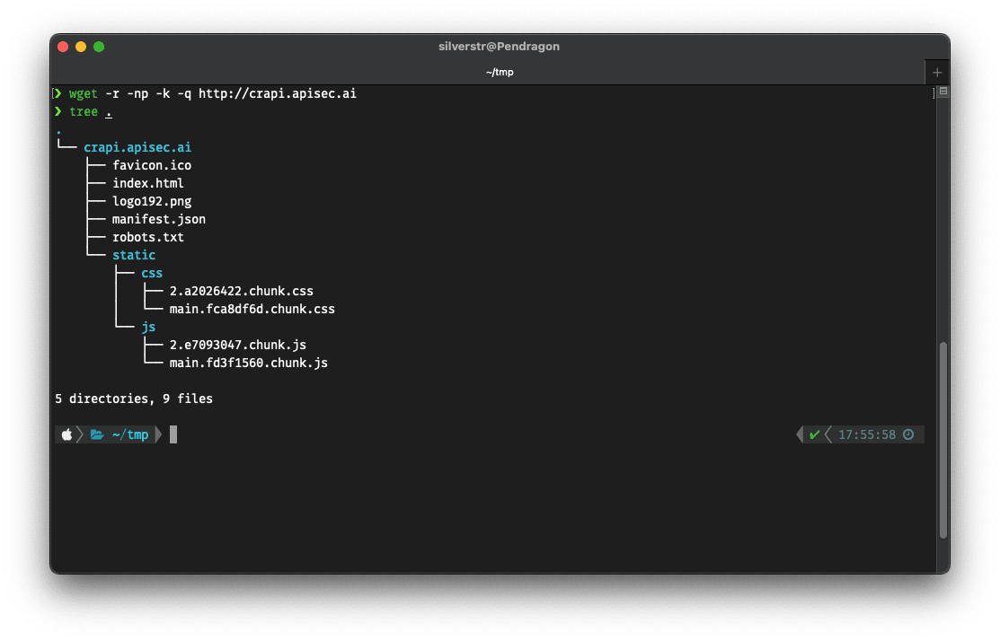

# miscellaneous notes

-   searching web archive

```html
http://web.archive.org/cdx/search/cdx?url=google.com%2Fapi%2F*&output=text&fl=original&collapse=urlkey&from=
```

-   Uncontrolled resource consumption

Azure shared access signature ie sas token if it doesnt have the appropriate expiration dat e or limit then attack here is to download and big blob (data) like 200GB and download it 10 times that will cause the usage to go up to 2TB.

-   subdomain enumeration idea. looking for staging test or dev sites always helps

```js
https://github.com/netsecurity-as/subfuz/blob/master/subdomain_megalist.txt
```

```bash
ffuf -w /subdomain_megalist.txt -u 'https://adminFUZZ.Target.com' -c  -t 350 -mc all  -fs 0

# example
admin-FUZZ.target.com E.G: admin-stg.target.com
FUZZ-admin.target.com E.G: cert-admin.target.com
adminFUZZ.target.com  E.G: admintest.target.com
FUZZadmin.target.com  E.G  testadmin.target.com
admin.FUZZ.target.com E.G: admin.dev.target.com

```

-   cencys

```js
1. openup https://search.censys.io/
2.Search the keyword with virtual host only-
`(services.tls.certificates.leaf_data.names: anywebsite.com) and services.http.response.status_code=”200"`

- search on cencys , fofa ,zoomeye , virustotal and others


-   cencys fancy search

```html
https://gpt.censys.io/
```

url would look like

```js
https://youraccount.blob.core.windows.net/?restype=container&comp=list&sv=2022-11-02&se=2023-05-24T09:51:36Z&sp=r&sig=<signature>

```

```js
console.log(__BUILD_MANIFEST.sortedPages); // all paths for Next.js websites

window.__NEXT_DATA__.props.pageProps; //returns back the data object passed from the server-side
```

-   Quickly access all js files of a target

```bash
wget -r -np -k -q <your_target_url>
```

    -r : Recursively download everything linked to the target
    -np : Don't ascend to the parent directory of the URL target entered
    -k : Make links in HTML and CSS point to locally downloaded files
    -q : Be quiet (no output to screen)

output example




CORS\* Burp Extension.
scans for cors misconfigurations.

### fuzzing for xss

I initiated fuzzing on the sign-up page using a wordlist of ==JavaScript variable names==.

During this process, I observed that a parameter name `appURL` was being ==reflected== within a script tag.


- Fuzzing for Api Docs in different locations on applications behind reverse proxies.
`
❌ GET /api/cbma/userauthorization/services/profile/validate/v1/swagger-ui/index.html
❌ GET /api/cbma/userauthorization/services/profile/validate/swagger-ui/index.html
❌ GET /api/cbma/userauthorization/services/profile/swagger-ui/index.html
❌ GET /api/cbma/userauthorization/services/swagger-ui/index.html
✅ GET /api/cbma/userauthorization/swagger-ui/index.html
`


if using vpn check whether you have a DNS leak
`https://www.dnsleaktest.com/`

nmap
```
nmap -PN -sA host -p - -o out.nmap
```

```subenum
subdomain database.
https://dash.pugrecon.celes.in/
```

exposed apache solr air 
- port 8983

ASP applications
1. Source code exposure through Git repo.
2. Information leak through Trace.axd endpoint

Takeaway: When encountering http://asp.net applications look for Trace.axd endpoint. It might leak information.